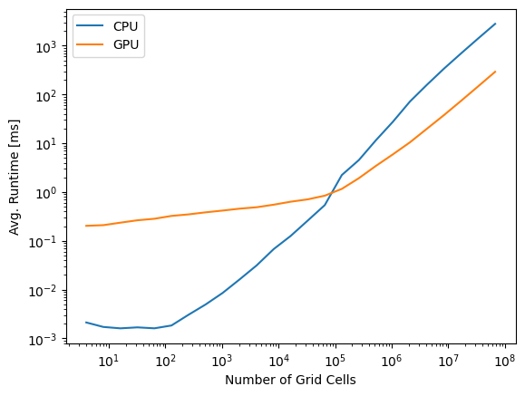
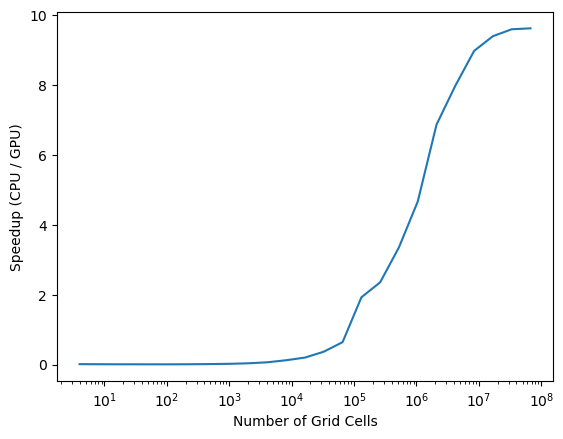
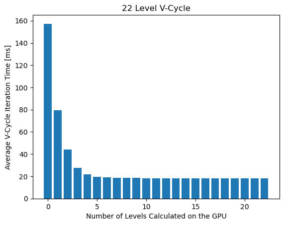

# GPU Multigrid Framework

This is a tool for solving differential equations with geometric
multigrid solvers. Currently it is limited to ODEs with Dirichlet
boundary conditions, but it is applicable to both linear and nonlinear
ODEs and it can be parallelized with CUDA for significant speedups.

### Algorithms

Solver implemented follow the algorithms for V-Cycles discussed in `A
Multigrid Tutorial` by William, Henson, and McCormick. These are:

* Linear solver
* Nonlinear full solver

Iterative solvers are to be implemented by the user, as they depend on
the differential equations to be solved. The algorithm implemented in
the examples are all Red-Black Gauss Seidel iterative algorithms.

### Examples

See the example README files for more details about the equations
being solved.

My tests were all run on a NVIDIA GeForce GTX 1650 with Max Q-Design
graphics card. It is of the Turing architecture with compute
capability 7.5.  Most notably, it has a maximum of 1024 resident
threads per SM and 32 resident warps per SM.

These plots show the GPU computing can yield speedups over 10 times
that of the CPU for sufficiently high grid resolution. These tests
were run with synchronous Red-Black Gauss Seidel iterative
algorithms, which compute slower than their asynchronous counterparts.

<p align="center">
 
</p>

While solvers on coarse resolution meshes do run faster on the CPU
than the GPU, there is no improvement when switching from GPUs to CPUs
on the coarse levels of a cycle.

<p align="center">

</p>

## Installation

This framework is implemented with C++ 20, CUDA toolkit v 12.9, and
CMake v 3.27. It was developed and tested on Ubuntu. It is likely
compatible with other Linux distributions and the Windows Subsystems
for Linux (WSL), but those have not been tested.

#### Code Compilation

From the library's root directory, run

```
cmake -B build -DCMAKE_BUILD_TYPE="Release"
cmake --build build -j
```

For debugging purposes, replace `Release` with `Debug`.

After compilation, examples can be found in `build/bin/examples`.

## References

Briggs, William L, Van E. Henson, and Steve. F. McCormick. A Multigrid
Tutorial. 2nd ed., SIAM, 2000.