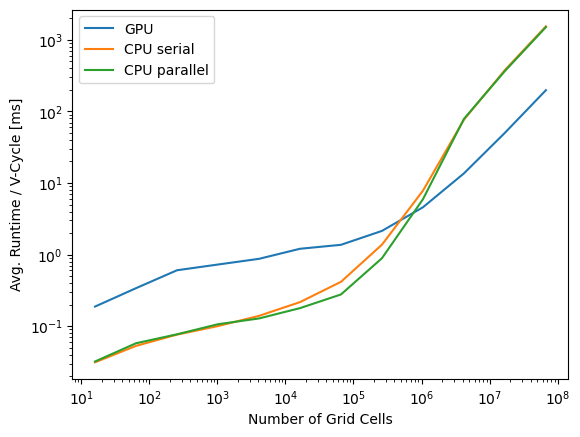
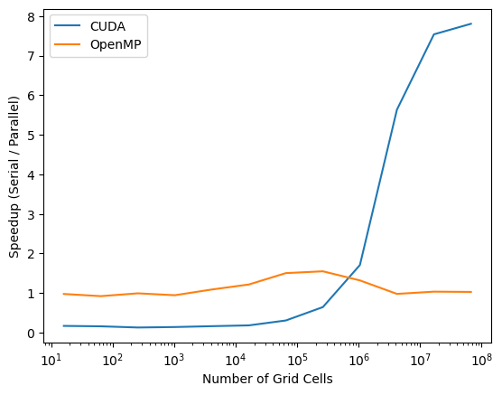

# Parallel Multigrid Framework

This is a tool for solving differential equations with geometric
multigrid solvers. Currently it is limited to steady, elliptic, 1D or
2D differential equations with Dirichlet, Neumann, mixed, and/or periodic
boundary conditions. Algorithms for both linear and nonlinear
differential equations are implemented. Solvers can be parallelized on
the CPU with OpenMP and the GPU with CUDA.

### Algorithms

Solvers implemented follow the algorithms for V-Cycles discussed in `A
Multigrid Tutorial` by William, Henson, and McCormick. These are:

* Linear solver
* Nonlinear full solver

Iterative solvers are to be implemented by the user, as they depend on
the differential equation to be solved. The algorithm implemented in
the examples are all Red-Black Gauss Seidel iterative algorithms.

### Examples

See the example README files for more details about the equations
being solved.

My tests were all run on a NVIDIA GeForce GTX 1650 with Max Q-Design
graphics card. It is of the Turing architecture with compute
capability 7.5.  Most notably, it has a maximum of 1024 resident
threads per SM and 32 resident warps per SM.

This plots show speedups with parallelized solely with OpenMP or with
CUDA.  OpenMP yields up to a 30\% speedup for meshes up to 1 million
grid cells. While finer meshes yield no performance boosts on CPUs,
they do yield up to 8 times speedups on GPUs. These tests were run
with synchronous Red-Black Gauss Seidel iterative algorithms using the
2D heat equation example with the linear multigrid solver.

<p align="center">
 
</p>

While solvers on coarse resolution meshes do run faster on the CPU
than the GPU, speedups when switching from GPUs to CPUs on the coarse
levels of a cycle only yield minimial speedup.

<p align="center">

</p>

## Installation

This framework is implemented with C++ 20, CUDA toolkit v 12.9, OpenMP
v 4.5 and CMake v 3.27. It was developed and tested on Ubuntu. It is
likely compatible with other Linux distributions and the Windows
Subsystems for Linux (WSL), but those have not been tested.

#### Code Compilation

From the library's root directory, run

```
cmake -B build -DCMAKE_BUILD_TYPE="Release" -DWITH_OPENMP=ON
cmake --build build -j
```

For debugging purposes, replace `Release` with `Debug`. Compiling
without OpenMP can be done by setting `ON` to `OFF`.

After compilation, examples can be found in `build/bin/examples`.

## References

Briggs, William L, Van E. Henson, and Steve. F. McCormick. A Multigrid
Tutorial. 2nd ed., SIAM, 2000.