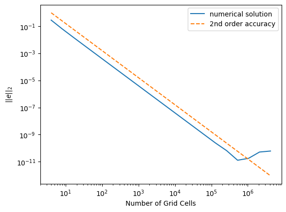

This experiment tests the accuracy of the 1d heat equation
example. Second order accuracy is expected and achieved for both the
linear and nonlinear solver. Shown below is the plot of the results
using the linear solver. The nonlinear solver yields nearly the exact
same errors, hence is omitted here.

