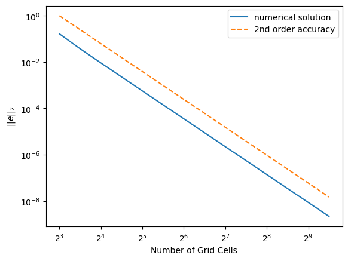

# Heat Equation

This example solves a steady, 1 dimensional heat equation with a
source term,

$$ -u_{xx} = f(x) $$

where $x \in \left[0, 1\right]$ and $u(0) = u(1) = 0$. The
differential equation is discretized with a second order central
difference scheme.  The following plot shows the accuracy of its
results using the linear solver.

