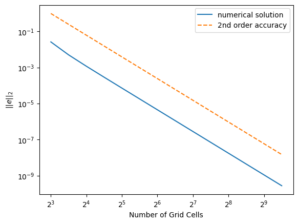

# Nonlinear Equation

This example solves the following nonlinear equation

$$ -u_{xx} + \gamma u u_x= f(x) $$

where $x \in \left[0, 1\right]$ and $u(0) = u(1) = 0$. The
differential equation is discretized with a second order central
difference scheme.  The following plot shows the accuracy of its
results using the nonlinear full solver.

