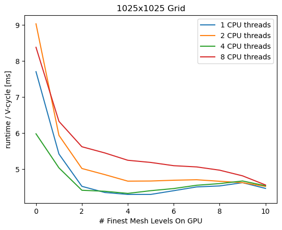

# CPU - GPU Tradeoff

This experiment checks to see if there is any benefit of to using GPUs
for multigrid solvers only on the finest mesh levels, while using CPUs
on the coarsest mesh levels. The script solves a steady 2D heat
equation PDE using the linear solver on a grid of 1025 x 1025
gridpoints. The plot show average runtimes of a V-cycle vs the number
of finest levels calculated on the GPU. Data was taken running CPU
calculations both in serial and in parallel with 2, 4 and 8 CPU
threads.

When running entirely on the CPU, we see that there is roughly a 30\%
speedup when using 4 CPU threads. When running entirely on the GPU, we
see that there is roughly an 80\% speedup over the serial CPU run, and
a 35\% speedup over the best parallel CPU run. When solving on both
CPU and GPU, we can get a minor speedup (about 3\% relative to a full
GPU run), but only when we see that when only 2-4 of the finest meshes
are run on the GPU, and meshes run on the CPU are run in parallel with
4 CPU threads.

According the [NVIDIA's blog
post](https://developer.nvidia.com/blog/high-performance-geometric-multi-grid-gpu-acceleration/)
on multigrid solvers, switching from GPU to CPU at coarse levels of
the cycles yield an improvement in F-cycles but not in V-cycles. It is
interesting to see that I can achieve slight speedups on
V-cycles. While I have not implemented F-cycles, it would be
interesting to implement them in the future and redo this experiment.
