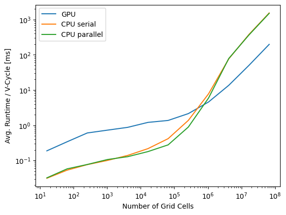
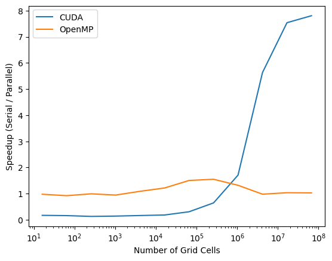

# Runtime Per Cycle

This experiment runs the 2D heat equation example with the linear
solver, averaging the time per iteration of the V-cycle over 200
iterations and after 10 iterations of burnin. 4 CPU threads were
parallelize solvers on the CPU. We see that calculations done on the
CPU are faster than those on the GPU for up to about 1 million grid
cells. After that, the GPU can get up to 8 times faster than the CPU
running in serial. CPU calculations done in parallel only yield up to
a 30\% speedup, only for meshes up to 1 mission grid cells.

 

